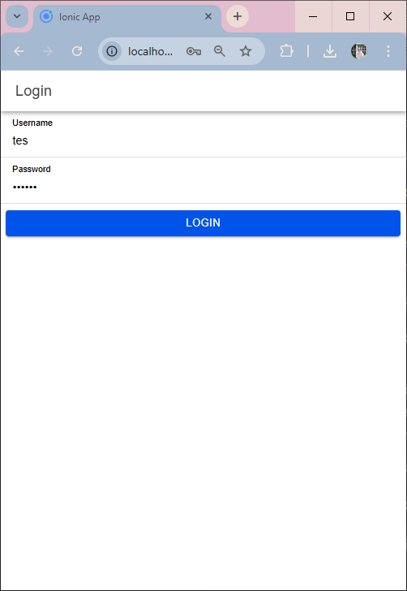

# Praktikum Mobile Pertemuan 8

Nama : Muthia Khanza
NIM : H1D022008
Shift Baru : C
Shift Lama : A

# Penjelasan

Alur kerja dimulai dari halaman login di Ionic dan berlanjut melalui backend PHP API yang mengakses database untuk memvalidasi kredensial

1. Halaman Login: Pengguna memasukkan username dan password pada halaman login Ionic. Ketika pengguna mengklik tombol Login, fungsi login pada login.page.ts akan memeriksa apakah kolom username dan password telah diisi. Jika tidak, sebuah notifikasi muncul bahwa kolom tidak boleh kosong.

2. Selanjutnya Kirim Data ke Backend: Jika kolom terisi, data login dikirim ke API PHP melalui postMethod di authentication.service.ts. Fungsi ini memanggil URL API yang diarahkan ke login.php.

3. PHP API:

   - File login.php menerima data login dari Ionic dan melakukan pencocokan dengan database.
   - Password di hash menggunakan MD5 (untuk keamanan dasar) sebelum dibandingkan dengan nilai yang tersimpan dalam tabel user.
   - Jika ditemukan kecocokan (data pengguna valid), API akan membuat respons JSON yang berisi username, token, dan status login berhasil.
   - Jika data tidak valid, status login dalam respons akan berisi gagal.

4. Proses Respons di Frontend:

   - Di Ionic, respons API diterima di login.page.ts.
   - Jika status_login berisi berhasil, aplikasi menyimpan token dan username menggunakan _Capacitor Preferences_ (untuk menyimpan data pengguna di perangkat), dan pengguna diarahkan ke halaman _home_.
   - Jika _status_login_ adalah "gagal", pengguna akan menerima notifikasi bahwa _username_ atau _password_ salah.

5. Autentikasi dan Guard:

   - Saat pengguna berhasil login, status autentikasi berubah menjadi true, yang dipantau oleh authGuard pada auth.guard.ts untuk melindungi akses ke halaman yang memerlukan autentikasi

6. Logout:
   - Pada halaman home, pengguna dapat menekan tombol Logout, yang akan memanggil logout pada home.page.ts.
